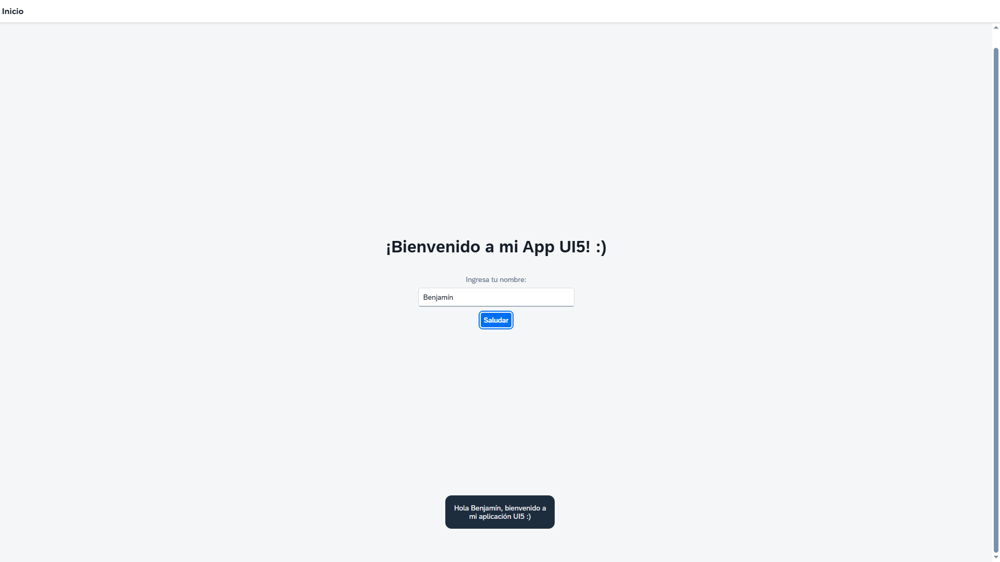

# 🚀 Mi Primera App SAPUI5 Freestyle


> Un proyecto "Hello World" interactivo creado desde cero sin utilizar plantillas para comprender el ciclo de vida, el bootstrapping y la arquitectura MVC de SAPUI5/OpenUI5 sin depender de plantillas automáticas.

---

## 🖼️ Demo



## 🎯 Objetivo del Proyecto
Este es un proyecto parte de la capacitación que estoy recibiendo en ARTECH para desarrollo SAP.
El propósito principal de este repositorio es desmitificar la "Caja Negra" de los generadores de aplicaciones Fiori. En lugar de usar herramientas CLI para crear la estructura, **cada archivo y carpeta fue creado manualmente** para entender su función específica.

### Conceptos Aprendidos:
* **Bootstrapping:** Configuración manual del `index.html` y carga de librerías desde CDN.
* **Arquitectura MVC:** Separación estricta entre la Vista (XML) y la Lógica (Controller.js).
* **Inyección de Dependencias:** Uso de `sap.ui.define` y `sap.ui.require`.
* **Manifest.json:** Configuración centralizada del descriptor de la aplicación.
* **Notación Húngara:** Uso de convenciones estándar (`oView`, `sNombre`, `oInput`).
* **Manipulación de Controles:** Uso de Getters y Setters (`getValue`, `setText`) en lugar de manipulación directa del DOM.

## 🛠️ Estructura del Proyecto

La aplicación sigue las mejores prácticas de estructuración de archivos de SAP:

```text
webapp/
├── controller/
│   └── App.controller.js  # Lógica del negocio (El "Cerebro")
├── view/
│   └── App.view.xml       # Interfaz de Usuario (La "Cara")
├── Component.js           # Encapsulamiento de la App
├── index.html             # Punto de entrada y Bootstrapping
└── manifest.json          # Configuración y Rutas
```

# 💻 Cómo ejecutarlo localmente
Este proyecto utiliza ui5-tooling (o cualquier servidor web estático) para ejecutarse.

## Clonar el repositorio:

```Bash
git clone https://github.com/tu-usuario/mi-primer-fiori.git
```

## Instalar dependencias (si aplica):

```Bash
npm install

# Luego, se podrá ejecutar el servidor utilizando los siguientes comandos

npm start
# O alternativamente:
ui5 serve -o index.html
Abrir en el navegador: http://localhost:8080
```
<br><br>
<div align="center">
  
  
</div>