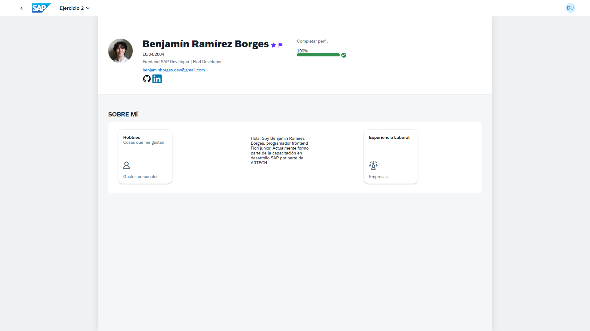
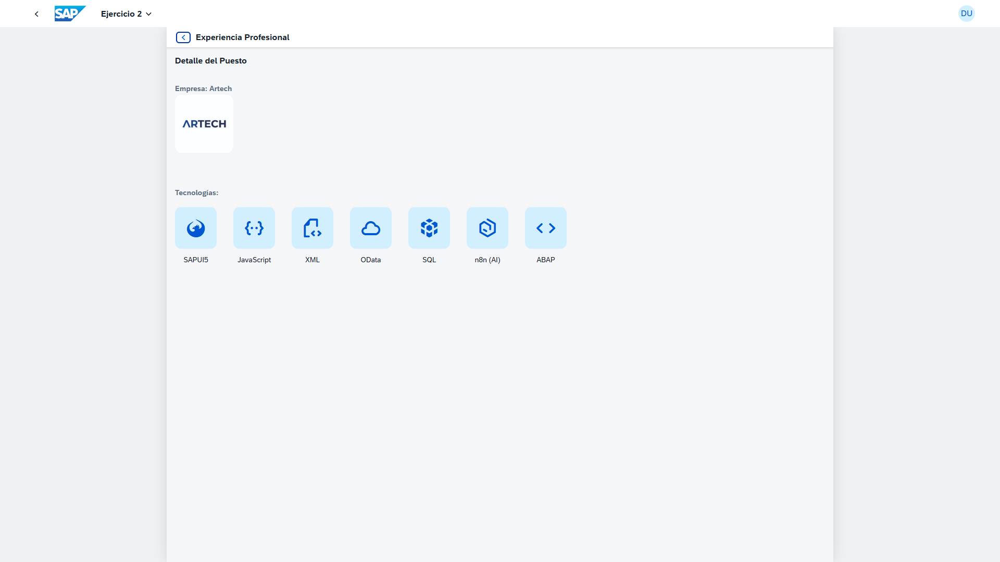
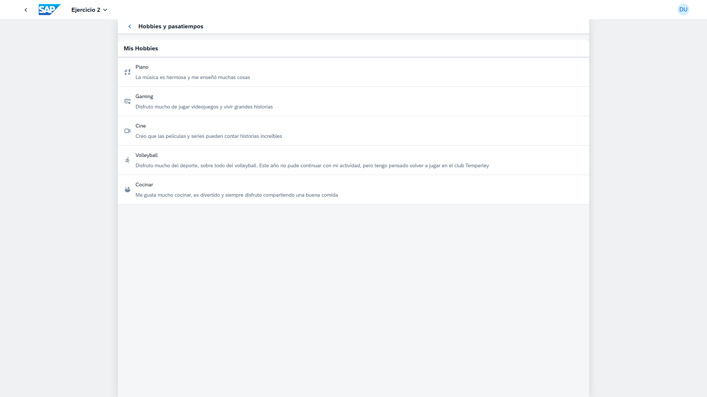

# 🚀 App de Perfil Profesional - Fiori Routing

> Una aplicación interactiva tipo "Curriculum Vitae" que implementa navegación avanzada, paso de parámetros por URL y layouts profesionales de SAP Fiori.

---

## 🖼️ Demo

## 🎯 Objetivo del Proyecto

Este proyecto es parte de la capacitación intensiva en desarrollo SAP de **ARTECH**. 
A diferencia del primer ejercicio "Freestyle", aquí utilizamos una **Plantilla Base (Fiori Generator)** para enfocarnos en la lógica de navegación y arquitectura de datos.

El objetivo fue construir una SPA (Single Page Application) que permitiera navegar entre distintas vistas sin recargar la página, pasando información dinámica entre controladores.

### 🧠 Conceptos Aprendidos:

* **Routing & Navigation:** Configuración profunda del `manifest.json` (Routes y Targets) para gestionar la navegación.
* **Paso de Parámetros:** Envío y recepción de argumentos dinámicos por URL (Ej: `.../Job/Artech`) para renderizar vistas de detalle.
* **JSON Models:** Creación y consumo de modelos locales (`data.json`) y modelos dinámicos en los controladores.
* **Fiori UX Controls:** Introducción a la implementación de controles visuales avanzados como `uxap:ObjectPageLayout`, `GenericTile`, `Avatar` y `HBox/VBox`.

  

  
  

